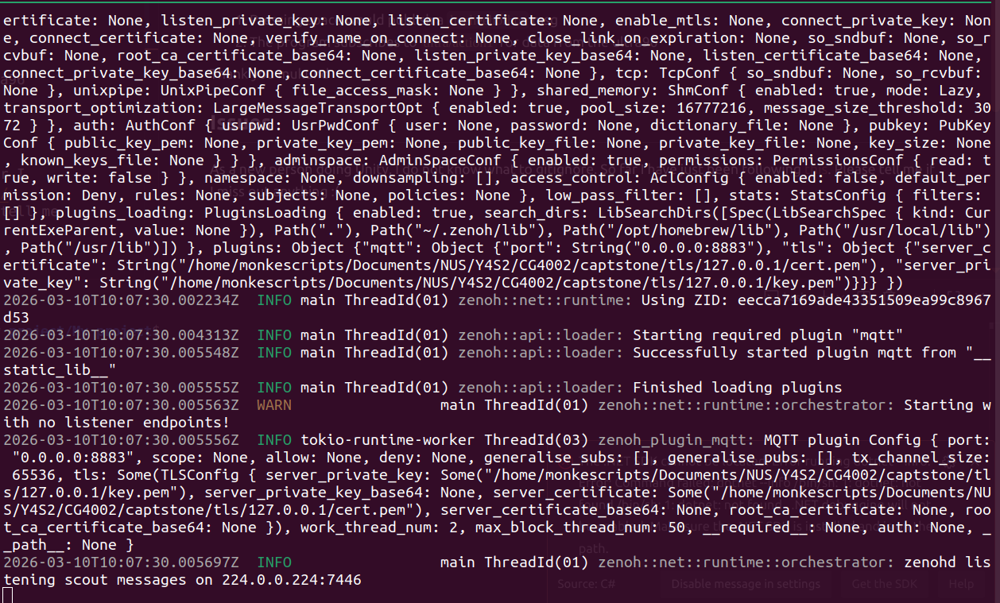
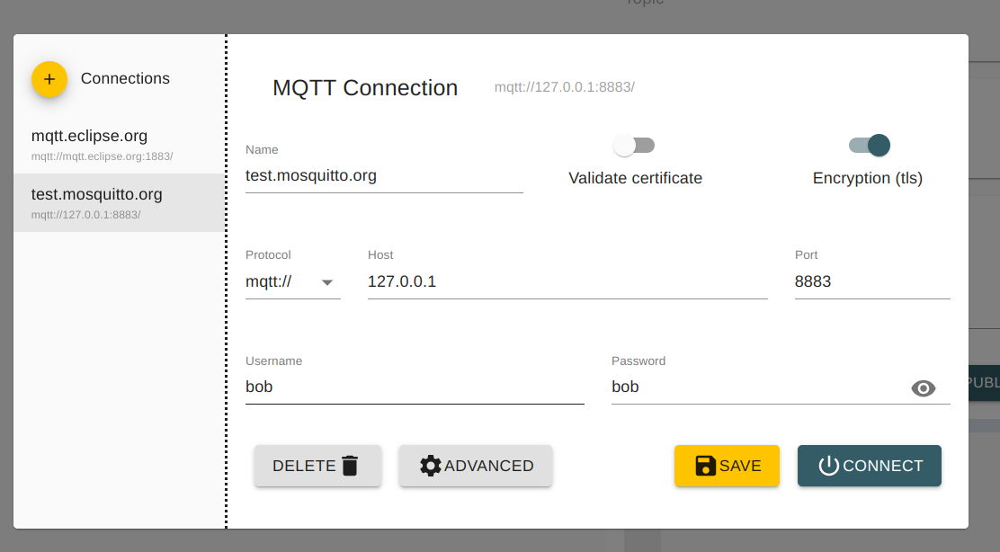
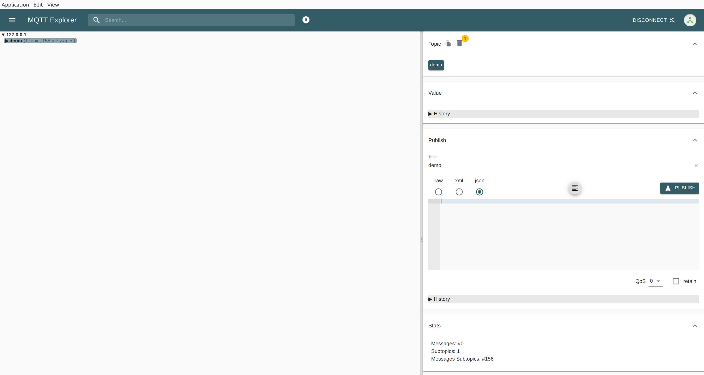
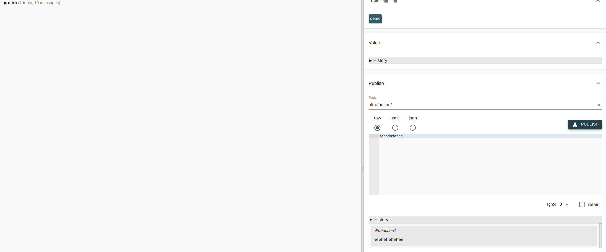

# save-the-cats unity
# Enabling communications
## Setup
### Step 1: Installing Zenoh
1. Add Eclipse Zenoh public key to apt keyring:
    ```bash
    curl -L https://download.eclipse.org/zenoh/debian-repo/zenoh-public-key | sudo gpg --dearmor --yes --output /etc/apt/keyrings/zenoh-public-key.gpg
    ```
2. Add Eclipse Zenoh private repository to the sources list:
    ```bash
    echo "deb [signed-by=/etc/apt/keyrings/zenoh-public-key.gpg] https://download.eclipse.org/zenoh/debian-repo/ /" | sudo tee -a /etc/apt/sources.list > /dev/null
    sudo apt update
    ```
3. Install zenoh-router package:
    ```bash
    sudo apt install zenoh
    ```
4. Then you can start the Zenoh router with this command:
    ```bash
    zenohd
    ```

### Step 2: Zenoh mqtt bridge installation
Adapted from: https://github.com/eclipse-zenoh/zenoh-plugin-mqtt
Since we already have the keyrings and sources list set up from the zenoh installation, we can directly install the zenoh-bridge-mqtt package:
```bash
sudo apt install zenoh-bridge-mqtt
```

### Step 3: Using mqtt explorer (mosquitto)
To install mosquitto broker, download the deban package from https://mqtt-explorer.com/ and install it via:
```bash
sudo dpkg -i <deb-package-file>
```
You should then be able to see the mqtt explorer icon in your Applications.

### Step 4: Generating SSL/TLS certificates
Adapted from: https://zenoh.io/docs/manual/tls/
To enable secure communication using SSL/TLS, you need to generate the necessary certificates. We use minica to generate our certificates.
First, install the [Go tools](https://golang.org/dl/) and set up your $GOPATH. Then, run:
```bash
go install github.com/jsha/minica@latest
```
In any directory run minica:
```bash
~/go/bin/minica --domains 127.0.0.1
```
On first run, minica will generate a keypair and a root certificate in the current directory, and will reuse that same keypair and root certificate unless they are deleted.

On each run, minica will generate a new keypair and sign an end-entity (leaf) certificate for that keypair. The certificate will contain a list of DNS names and/or IP addresses from the command line flags. The key and certificate are placed in a new directory whose name is chosen as the first domain name from the certificate, or the first IP address if no domain names are present. It will not overwrite existing keys or certificates.

    The certificate will have a validity of 2 years and 30 days.

    After generating the certificates, you should expect the following files:
    - `minica.pem`: The root CA
    - `minica-key.pem`: The root CA key

    In the specific domain folder (e.g. 127.0.0.1 in this case):
    - `cert.pem`: Server side certificate
    - `key.pem`: Server side key

    Please add the paths to these files in `local_computer/BRIDGE_CONFIG.json5`
    >Note that `cert.pem` and `key.pem` are need for the MQTT explorer as well as the Unity program as well for MQTTS communication

### Step 5: Adding certificate path to zenoh_bridge configuration
In zenoh_bridge/BRIDGE_CONFIG.json5, add the paths to the generated certificates:

```json
      tls: {
        ////
        //// server_private_key: TLS private key provided as either a file or base 64 encoded string.
        ////                     One of the values below must be provided.
        ////
        server_private_key: "/home/monkescripts/Documents/NUS/Y4S2/CG4002/captstone/tls/127.0.0.1/key.pem",
        // server_private_key_base64: "base64-private-key",
      
        ////
        //// server_certificate: TLS public certificate provided as either a file or base 64 encoded string.
        ////                     One of the values below must be provided.
        ////
        server_certificate: "/home/monkescripts/Documents/NUS/Y4S2/CG4002/captstone/tls/127.0.0.1/cert.pem",
        // server_certificate_base64: "base64-certificate",
      
        ////
        //// root_ca_certificate: Certificate of the certificate authority used to validate clients connecting to the MQTT server.
        ////                      Provided as either a file or base 64 encoded string.
        ////                      This setting is optional and enables mutual TLS (mTLS) support if provided.
        ////
        // root_ca_certificate: "/path/to/root-ca-certificate.pem",
        // root_ca_certificate_base64: "base64-root-ca-certificate",
      }
```

### Step 6: Setup MQTT explorer
To enable MQTTS (MQTT + TLS), we need to add our own certificates into the application (Server side certificate and Server side key)
1. Open the MQTT explorer and under the `advanced` setting portion, add `cert.pem` and `key.pem` accordingly (You should already have generated the certificates based on the previous step).
2. Change the port to `8883` and toggle the TLS option
You should be able to see the topics streaming in.

### Step 7: Add root CA certificate to Unity application
Please add `cert.pem` to `Assets/StreamingAssets`

## Running communications
### Step 1: Run Zenoh bridge
``` bash
    zenoh-bridge-mqtt -c zenoh_bridge/BRIDGE_CONFIG.json5 
```
You should be able to see something like this:


### Step 2: Run MQTT explorer
Connect with these settings:

You should be able to see something like this:

> When you run the demo topic would not be present but you publish your own topic in the gui to check


### Step 3: Run Unity application
Run the unity application, should be able to see the published messages based on what you publish in the MQTT explorer.

So far: 
1. Pressing space would publish a `heeheehorhor` msg
2. The program subscribes to `ultra/action1` for data from the ultra96

Thank you mukund

## Issues
As a new person doing Unity, I do not know what to gitignore. So far I have just been following [this](https://stackoverflow.com/questions/59742994/should-i-push-the-unity-library-folder-to-github). Please tell me if I miss out anything :(